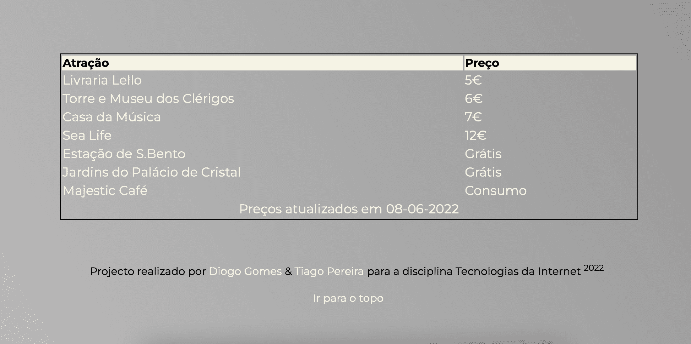
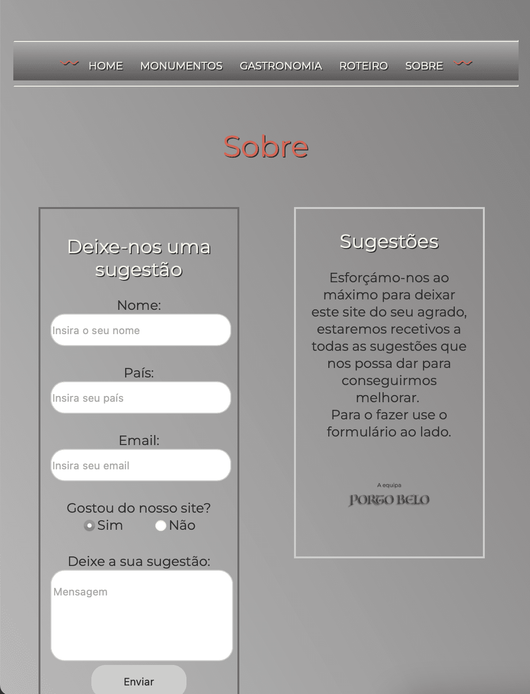

# Porto Belo (Beautiful Oporto)

Repository to host the project developed for Internet Technologies, a fisrt year subject at Universidade da Maia. Developed by Group : [@DiogoGomes](https://github.com/diogogomes-pt), Tiago Praça Pereira [@TiagoPereira](https://github.com/tiagopraca) and Pedro Tomás Coutinho Có [@PedroCoutinho](https://github.com/diogogomes-pt)

## Short theme description

In this project we intend to create a faster and more organized way to make known the different tourist aspects of the city of Oporto. For this we created a website divided into 5 parts, the "Home" where we presented a brief summary of the city. The "Monuments" page where we present some of the city's monuments and a description of them. "Gastronomy" page, a page where we presented the city's gastronomy with some of the typical dishes. On the "Itinerary" page we suggest an itinerary for a day in the city, with prices included. Finally, we have a page "About "where we talked a little about the project and presented a form to receive suggestions.

## Repository organization

* Source code is in the [src folder](src/).
* Report chapters are in [doc folder](doc/).
* Final Result Imagesa are in [images folder](doc/images)

## Gallery 1

_Please provide a galery of the final result, with small images_
| Página      | Imagem |
| ----------- | ----------- |
| Página Ínicial      |        |
| Elementos da Página Ínicial   | .png)       |
| Monumentos  |        |
| Gastronomia      |        |
| Roteiro   |        |
| Sobre      |        |
| Página Ínicial Formato Móvel   |        |
| Monumentos Formato Móvel      |        |
| Gastronomia Formato Móvel   |        |
| Sobre Formato Móvel   |        |

## Technologies

* XML
* HTML5 + CSS3
* Javascript

## Report

### Project presentation
* Chapter 1: [Project presentation](doc/c1.md)
### User Interface 
* Chapter 2: [User Interface Prototype and Sitemap](doc/c2.md)
### Product
* Chapter 3: [Product](doc/c3.md)
### Presentation
* Chapter 4: [Presentation](doc/c4.md)

## Team
* Diogo Gomes Araújo [@DiogoGomes](https://github.com/diogogomes-pt)
* Tiago Praça Pereira [@TiagoPereira](https://github.com/tiagopraca)
* Pedro Tomás Coutinho Có [@PedroCoutinho](https://github.com/diogogomes-pt)
